<div align="center">

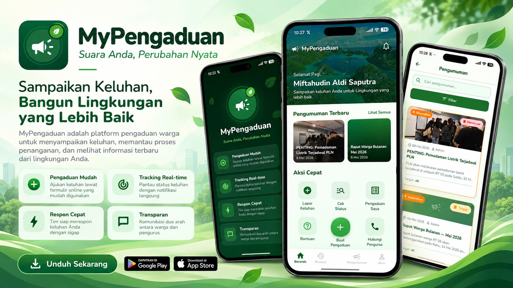

# MyPengaduan

**Suara Anda, Perubahan Nyata**

Aplikasi mobile pengaduan warga yang terhubung dengan backend Laravel.
Studi kasus: **RT 05 Gang Annur II**.


[Unduh APK](https://drive.google.com/drive/folders/1HhLJULIqwtSnwuUuyLL0gC318XoqON4k) ·
[Fitur](#-fitur) ·
[Screenshot](#-screenshot) ·
[Instalasi](#-instalasi) ·
[Dokumentasi](#-dokumentasi)

</div>

---

## 📖 Tentang Aplikasi

MyPengaduan memudahkan warga menyampaikan keluhan lingkungan, memantau proses penanganannya, dan membaca pengumuman dari pengurus RT. Di sisi pengurus, tersedia panel admin untuk memverifikasi warga, menindaklanjuti pengaduan, mengelola pengumuman, dan melihat laporan statistik.

| | |
|---|---|
| ➕ **Pengaduan Mudah** | Ajukan keluhan lewat formulir bertahap, lengkap dengan kategori, lokasi, dan foto. |
| 📍 **Tracking Real-time** | Pantau status pengaduan (Diterima → Diverifikasi → Dalam Proses → Selesai) dengan notifikasi langsung. |
| ⚡ **Respon Cepat** | Pengurus menanggapi dan menyelesaikan pengaduan langsung dari aplikasi. |
| 💬 **Transparan** | Komunikasi dua arah lewat tanggapan petugas dan komentar pengumuman. |

---

## ✨ Fitur

### Untuk Warga

- **Autentikasi** — Login, registrasi dengan verifikasi KTP, lupa/reset password (OTP email), logout.
- **Pengaduan** — Buat, ubah, dan lihat detail pengaduan beserta riwayat status dan tanggapan petugas.
- **Pengaduan Publik** — Warga yang sudah login dapat membaca pengaduan berjenis *Publik* milik warga lain (tanpa identitas pelapor). Pengaduan *Privat* hanya terlihat oleh pelapor dan admin.
- **Pengumuman** — Pengumuman dari RT/admin dengan filter, prioritas, lampiran, bookmark, dan komentar.
- **Notifikasi** — Push notification via Firebase Cloud Messaging (FCM) untuk perubahan status, pengumuman baru, dan hasil verifikasi akun.
- **Beranda & Aksi Cepat** — Pengumuman terbaru dan pintasan ke Lapor Keluhan, Cek Status, Pengaduan Saya, Bantuan, dan Hubungi Pengurus.
- **Profil** — Lihat dan ubah profil, foto, dan ganti password.
- **Bantuan** — FAQ dan halaman kontak pengurus.

### Untuk Admin / Pengurus RT

- **Dashboard** — Ringkasan harian, grafik pengaduan 7 hari terakhir, dan pengaduan terbaru.
- **Kelola Pengaduan** — Filter status, tandai diproses, tolak, selesaikan dengan respons & foto dokumentasi, hapus attachment, dan tempat sampah (trash).
- **Kelola Pengumuman** — Tambah, ubah, dan hapus pengumuman dengan gambar dan lampiran.
- **Kelola Kategori** — CRUD kategori keluhan beserta daftar pengaduan per kategori.
- **Kelola Pengguna** — Tambah/ubah pengguna, verifikasi identitas KTP, aktif/nonaktifkan akun, reset password.
- **Laporan & Statistik** — Ringkasan, laporan keluhan, laporan pengguna, serta ekspor **PDF** dan **Excel**.

---

## 📸 Screenshot

### Aplikasi Warga

<table>
  <tr>
    <td align="center">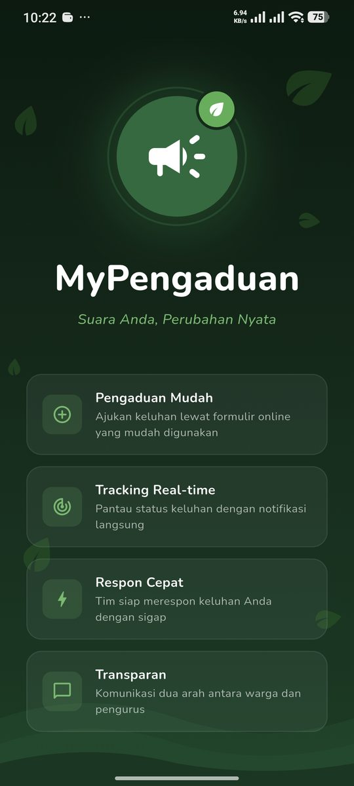<br><sub><b>Splash</b></sub></td>
    <td align="center">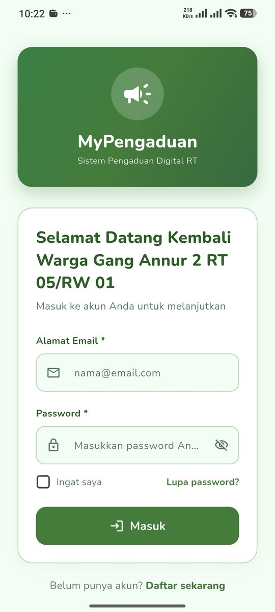<br><sub><b>Login</b></sub></td>
    <td align="center">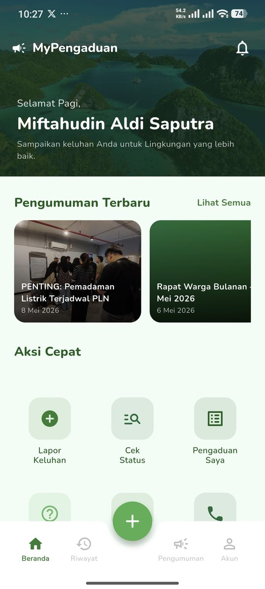<br><sub><b>Beranda</b></sub></td>
    <td align="center">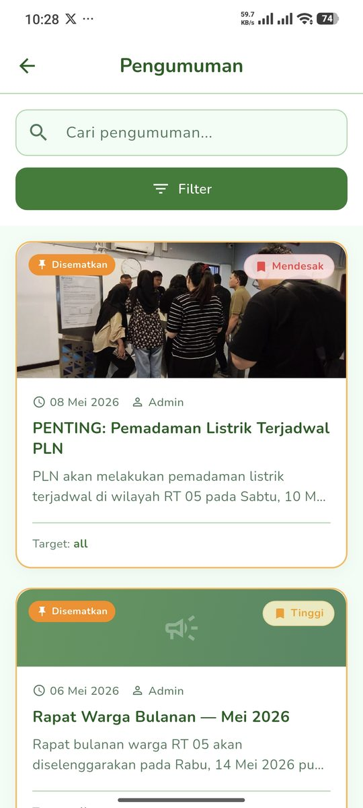<br><sub><b>Pengumuman</b></sub></td>
    <td align="center">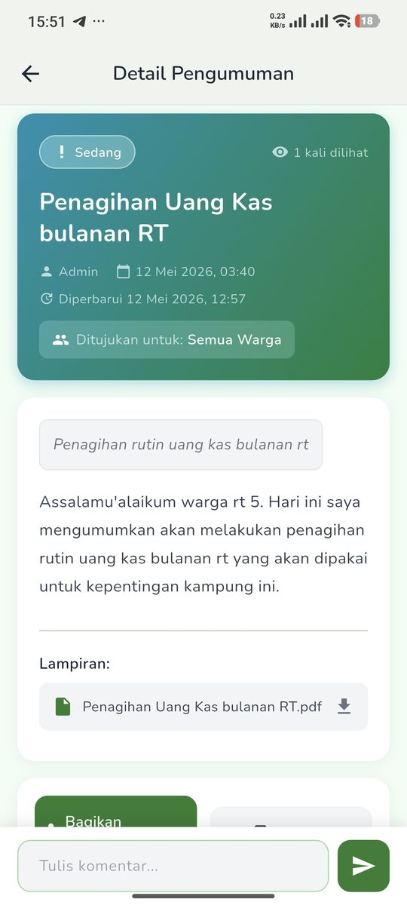<br><sub><b>Detail Pengumuman</b></sub></td>
  </tr>
  <tr>
    <td align="center">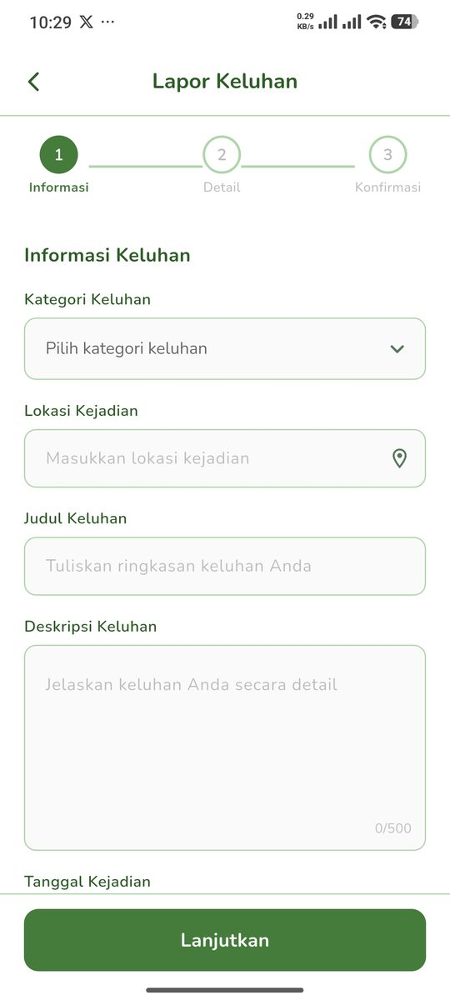<br><sub><b>Lapor Keluhan</b></sub></td>
    <td align="center">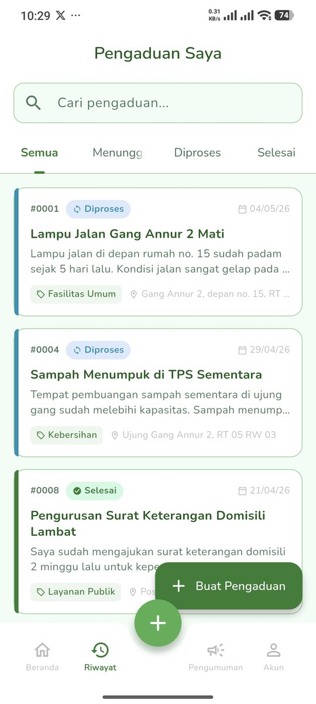<br><sub><b>Pengaduan Saya</b></sub></td>
    <td align="center">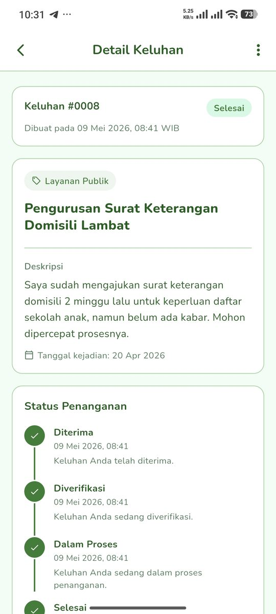<br><sub><b>Detail & Status</b></sub></td>
    <td align="center">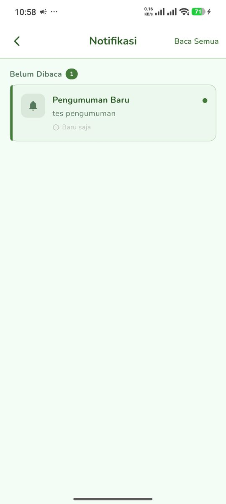<br><sub><b>Notifikasi</b></sub></td>
    <td align="center">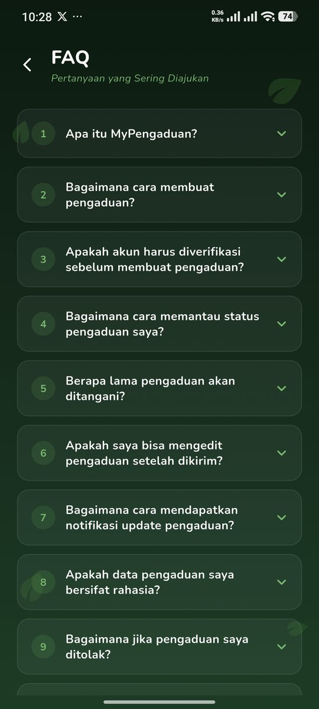<br><sub><b>FAQ</b></sub></td>
  </tr>
</table>

### Panel Admin

<table>
  <tr>
    <td align="center">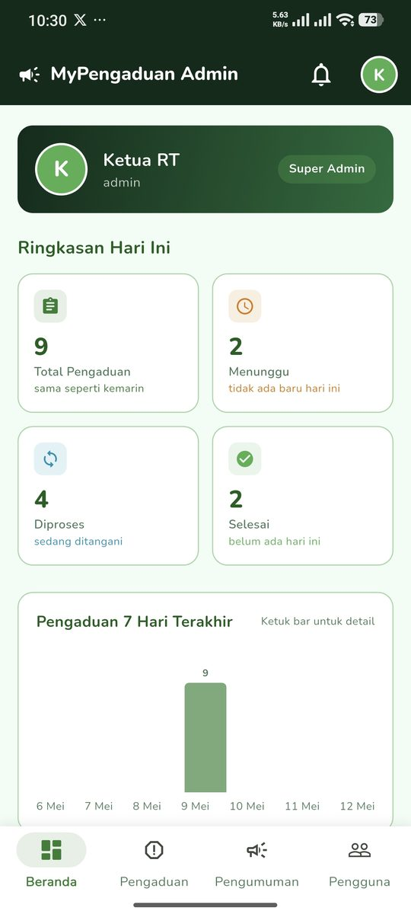<br><sub><b>Dashboard</b></sub></td>
    <td align="center">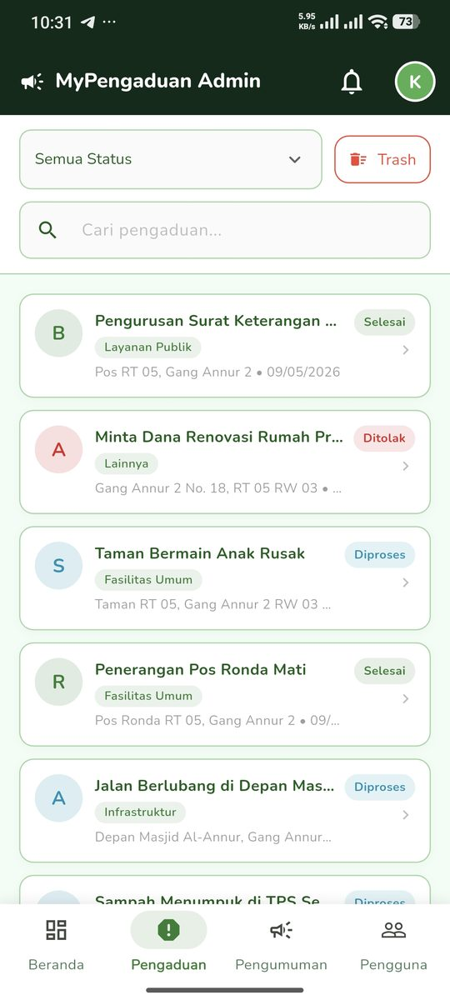<br><sub><b>Kelola Pengaduan</b></sub></td>
    <td align="center">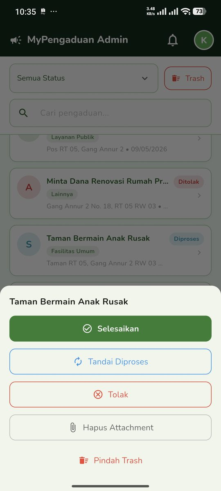<br><sub><b>Aksi Pengaduan</b></sub></td>
    <td align="center">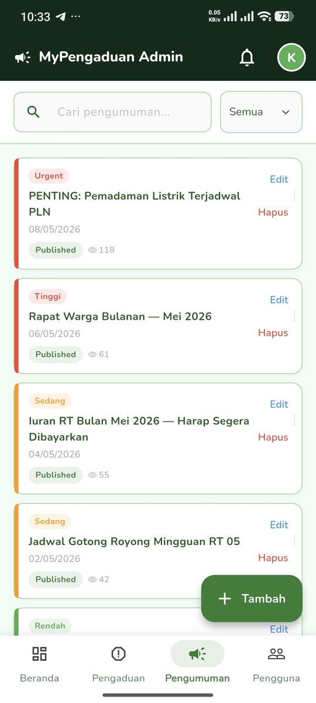<br><sub><b>Pengumuman</b></sub></td>
    <td align="center">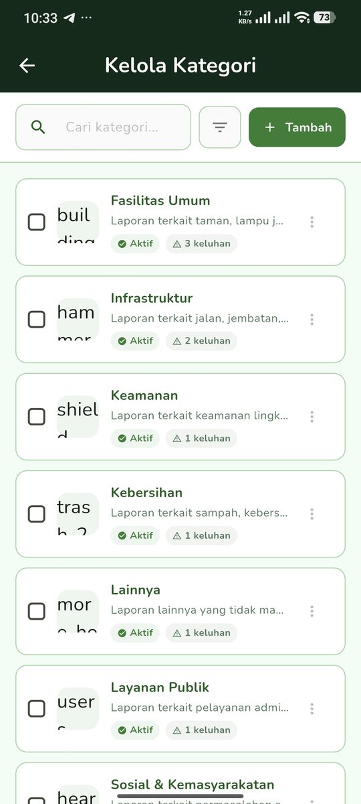<br><sub><b>Kategori</b></sub></td>
  </tr>
  <tr>
    <td align="center">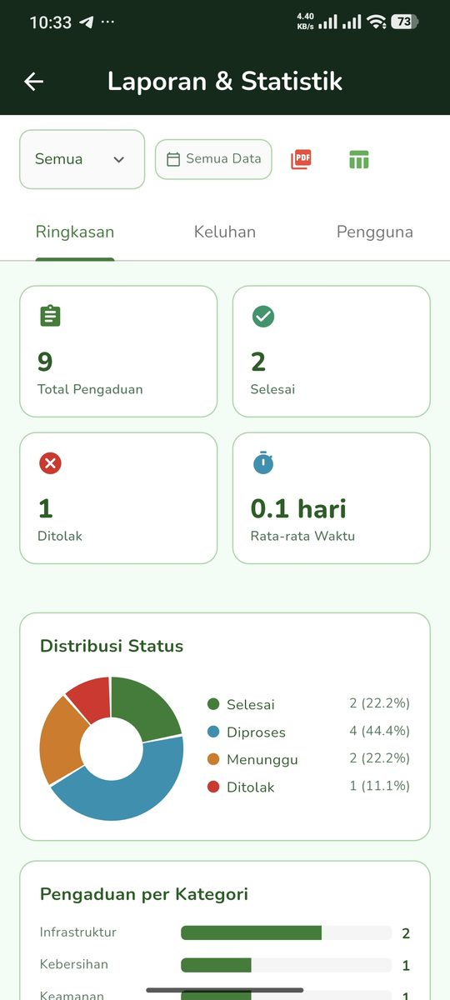<br><sub><b>Laporan & Statistik</b></sub></td>
    <td></td><td></td><td></td><td></td>
  </tr>
</table>

---

## 🛠️ Tech Stack

| Kategori | Library |
|---|---|
| Framework | Flutter 3.5.1+ (Dart 3.5.1+) |
| State Management | [provider](https://pub.dev/packages/provider) (`ChangeNotifier`) |
| Routing | [go_router](https://pub.dev/packages/go_router) |
| HTTP Client | [dio](https://pub.dev/packages/dio) |
| Storage | `flutter_secure_storage` (token), `shared_preferences` (preferensi) |
| Push Notification | `firebase_messaging` + `flutter_local_notifications` |
| Fonts | `google_fonts` (Nunito) |
| Export Laporan | `pdf`, `excel` |

---

## 🚀 Instalasi

### Prasyarat

1. **Flutter SDK** 3.5.1 atau lebih baru
2. **Android Studio** / VS Code dengan ekstensi Flutter
3. **Akun Firebase** untuk push notification
4. **Backend API** Laravel MyPengaduan yang sudah berjalan

### 1. Clone & install dependency

```bash
git clone https://github.com/Mifta24/mypengaduan_app.git
cd mypengaduan_app
flutter pub get
```

### 2. Konfigurasi Firebase

**Opsi A — FlutterFire CLI (disarankan)**

```bash
dart pub global activate flutterfire_cli
flutterfire configure
```

Perintah ini membuat `lib/firebase_options.dart` secara otomatis.

**Opsi B — Manual**

1. Buat project di [Firebase Console](https://console.firebase.google.com/).
2. Unduh `google-services.json` dan letakkan di `android/app/`.
3. Perbarui `lib/firebase_options.dart` dengan kredensial Anda.

### 3. Atur Base URL API

Default ada di [lib/config/app_config.dart](lib/config/app_config.dart). Untuk mengarahkan ke backend lokal, gunakan `--dart-define`:

```bash
flutter run --dart-define=BASE_URL=http://192.168.1.100:8000/api/
```

### 4. Terima lisensi Android

```bash
flutter doctor --android-licenses
```

---

## 🏃 Menjalankan Aplikasi

```bash
# Jalankan di device/emulator yang terhubung
flutter run

# Build APK release
flutter build apk --release

# Jalankan test
flutter test
```

APK siap pakai tersedia di [folder Google Drive proyek](https://drive.google.com/drive/folders/1HhLJULIqwtSnwuUuyLL0gC318XoqON4k) (`app-release.apk`).

---

## 📂 Struktur Proyek

```
lib/
├── config/           # Konfigurasi (base URL API, storage keys, dll)
├── models/           # Data models (JSON ⇄ Dart object)
├── services/         # API client (Dio) & integrasi FCM
├── providers/        # State management (ChangeNotifier)
├── routes/           # GoRouter & auth guard
├── theme/            # Design system terpusat
├── screens/          # UI per fitur (warga & admin)
├── widgets/          # Komponen UI reusable
└── main.dart         # Entry point
```

Detail tiap layer dan alur datanya ada di [docs/ARCHITECTURE.md](docs/ARCHITECTURE.md).

---

## 🔧 Akun Demo

| Peran | Email | Password |
|---|---|---|
| Admin | admin@example.com | password |
| Warga | user@example.com | password |

> Akun di atas hanya berlaku jika backend di-seed dengan data demo.

---

## 📚 Dokumentasi

| Dokumen | Isi |
|---|---|
| [docs/ARCHITECTURE.md](docs/ARCHITECTURE.md) | Struktur project, tanggung jawab tiap layer, alur data, alur autentikasi & push notification |
| [docs/THEME.md](docs/THEME.md) | Design system: palet warna, tipografi, style komponen, cara mengubah tema |
| [docs/ROUTING.md](docs/ROUTING.md) | Daftar route, auth guard, transisi halaman, cara menambah route baru |
| [docs/API_INTEGRATION.md](docs/API_INTEGRATION.md) | Konfigurasi API, alur token, daftar endpoint per service, format response |
| [docs/QUICK_START.md](docs/QUICK_START.md) | Cara menjalankan app, hot reload, troubleshooting, tips kustomisasi |
| [lib/screens/admin/README.md](lib/screens/admin/README.md) | Struktur & aturan konsistensi UI khusus modul Admin |
| [docs/superpowers/specs/](docs/superpowers/specs/) | Spesifikasi desain fitur, mis. akses pengaduan publik untuk pengguna login |

---

<div align="center">

**MyPengaduan** · Versi 1.0.0 · Flutter 3.5.1+ · Android & iOS

</div>
